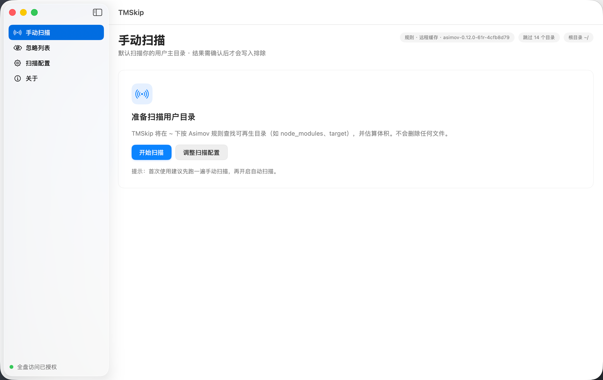
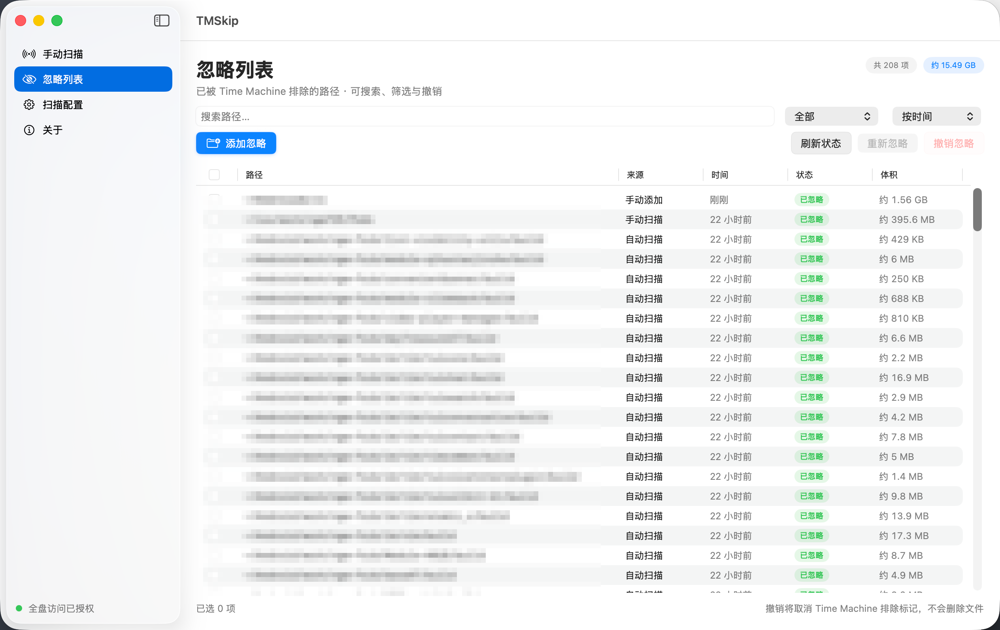
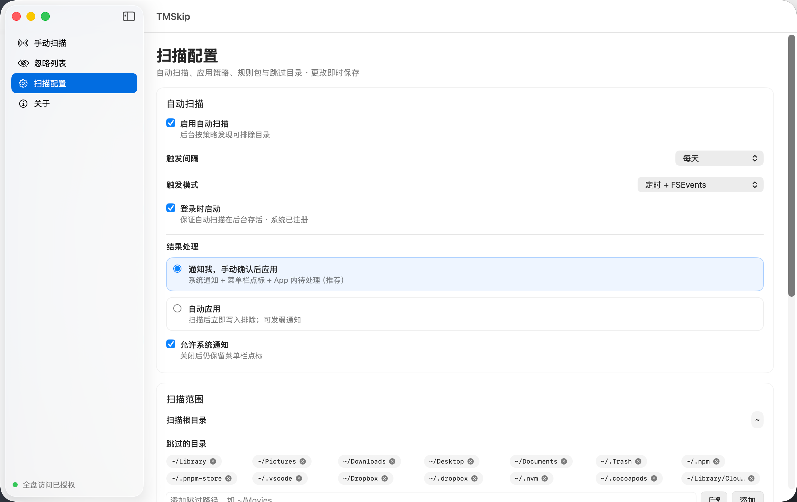
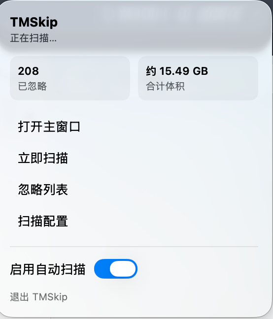

# TMSkip

把可再生目录（`node_modules`、`target`、`Pods` 等）移出 Time Machine 备份。

| 项 | 内容 |
|----|------|
| 产品名 | **TMSkip** |
| 平台 | macOS 13+ |
| 技术 | SwiftUI |
| Bundle ID | `app.tmskip.mac` |
| 仓库 | [github.com/JosephusZhou/TMSkip](https://github.com/JosephusZhou/TMSkip) |

## 界面预览

### 手动扫描

一键扫描用户主目录，按 Asimov 规则查找可再生目录，结果需确认后才写入排除。



### 忽略列表

所有已排除路径统一管理，支持搜索、筛选、排序、撤销与手动添加。



### 扫描配置

自动扫描策略、触发模式、结果处理方式、扫描范围与跳过目录均可自定义。



### 菜单栏

驻留菜单栏，随时查看已忽略体积、触发扫描、切换自动扫描开关。



## 运行

```bash
cd TMSkip                 # 仓库根目录
open TMSkip.xcodeproj
# 或命令行：
xcodebuild -project TMSkip.xcodeproj -scheme TMSkip -configuration Debug -destination 'platform=macOS' build
open ~/Library/Developer/Xcode/DerivedData/TMSkip-*/Build/Products/Debug/TMSkip.app
```

首次启动会引导 **完全磁盘访问**。授权后可：

1. **手动扫描** `~/`（Asimov 规则快照）
2. 查看结果体积、勾选、应用 Time Machine 排除（位于其他应用包内的路径自动跳过）
3. 在 **忽略列表** 中搜索、筛选、撤销，或手动添加要排除的目录
4. 在 **扫描配置** 中改策略、跳过目录、规则开关
5. 使用 **菜单栏** 快捷入口

安全边界：扫描只读；应用排除只写备份元数据（`isExcludedFromBackup`），**不删除任何文件**，也不会进入其他应用的 `.app` 包。写入被系统权限拦截时（如「App 管理」），完成页会给出授权引导。

## 分发

### 选项 A：付费开发者计划（$99/年，推荐，用户体验最好）

1. 创建 **Developer ID Application** 证书（Xcode 或 developer.apple.com）
2. 一次性配置公证凭据：
   ```bash
   xcrun notarytool store-credentials TMSkipNotary \
       --apple-id <AppleID> --team-id <TeamID> --password <App专用密码>
   ```
3. 打包（自动检测证书 → 重签 → 公证 → 装订）：
   ```bash
   ./Scripts/make-release.sh   # 产出 dist/TMSkip-<版本>.zip
   ```
用户下载解压即可打开；首次使用授权一次「完全磁盘访问」。

### 选项 B：零成本发未公证包

同样用 `./Scripts/make-release.sh` 打包（无 Developer ID 证书时自动跳过公证）。
接收方首次打开需绕过 Gatekeeper：**右键 → 打开**，或：

```bash
xattr -cr /Applications/TMSkip.app
```

两种子模式：

- 默认：保留工程签名（本机配置了 `Config/Local.xcconfig` 时，**包内会含你的证书身份：姓名/邮箱**，接收方用 `codesign -dvvv` 可见）。
- **匿名分发**（推荐给不想暴露身份的场景）：

  ```bash
  ANON=1 ./Scripts/make-release.sh
  ```

  强制 ad-hoc 重签，包内不含任何证书身份（已验证：`codesign -dvvv` 仅显示
  `Signature=adhoc`，全包搜索不到姓名/邮箱/Team ID）。接收方体验不变。
  注意：ad-hoc 包更新版本时，新包 cdhash 不同，接收方可能需重新授权一次
  完全磁盘访问（仅在系统弹出时）。

### 选项 C：只发源码，用户自行构建

```bash
git clone <repo> && cd TMSkip && open TMSkip.xcodeproj
# Xcode → Signing & Capabilities → 勾选自动签名，选择自己的 Personal Team
```

仓库默认 ad-hoc 签名，clone 后即可构建。提示：TCC 授权（完全磁盘访问等）绑定
签名身份，ad-hoc 每次重编译都要重新授权；想要「授权一次、重编译通用」，复制
`Config/Local.xcconfig.example` 为 `Config/Local.xcconfig` 并填入自己的开发者证书
（该文件不入库）。Debug 与 Release 使用同一张证书时，两边共享同一份授权。

### `make-release.sh` 环境变量

| 变量 | 作用 |
|------|------|
| `ANON=1` | 匿名分发：强制 ad-hoc 重签并跳过公证（优先级最高，即使检测到 Developer ID） |
| `IDENTITY` | 指定签名身份（默认自动检测 `Developer ID Application` 证书） |
| `NOTARY_PROFILE` | 公证用的 keychain profile（默认 `TMSkipNotary`） |

## 工程结构

```text
TMSkip/
├── TMSkip.xcodeproj
├── TMSkip/
│   ├── TMSkipApp.swift          # @main：主窗口 + 菜单栏 + AppDelegate
│   ├── AppModel.swift           # 唯一业务编排中心
│   ├── Models/                  # 领域模型 + 内置规则包（RulePackage+Bundled.swift）
│   ├── Services/                # 扫描、自动扫描(FSEvents/定时)、排除、体积、FDA、设置、通知、登录项、忽略存储、窗口路由、扫描日志
│   ├── Views/                   # 手动扫描 / 忽略列表 / 配置 / 关于 / Onboarding / 菜单栏 / 共享组件
│   ├── Resources/               # 资产（AppIcon 等）
│   └── TMSkip.entitlements      # 沙箱关闭（需完全磁盘访问）
├── Config/
│   ├── Signing.xcconfig         # 入库默认签名（ad-hoc）+ 末尾 include Local
│   └── Local.xcconfig.example   # 本机个人签名模板（复制为 Local.xcconfig，已 gitignore）
├── Scripts/
│   ├── make-release.sh          # 打包发布（自动检测 Developer ID 并公证）
│   ├── dev-run.sh               # 开发循环：构建 + 重启
│   └── make_app_icon.swift      # 生成 AppIcon 图标的辅助脚本
└── TMSkipTests/                 # 单元测试（7 个测试类）
```

## 已拍板决策

1. 扫描根：MVP 默认 `~/`，模型预留多根（M3）
2. 待处理：系统通知 + 菜单栏点标 + App 内队列（通知可关、点标保留）
3. 体积估算：MVP 已接异步计算
4. 产品/工程名：TMSkip
5. 应用包保护：不写入其他应用（`.app`）包内

## 当前 MVP 范围

- [x] SwiftUI 左栏 + 右内容
- [x] FDA Onboarding
- [x] 手动扫描 + 结果确认 + 应用排除
- [x] 体积估算（异步，失败/超时降级）
- [x] 忽略列表：搜索 / 筛选 / 排序 / 状态识别（异常、缺失）+ 撤销 / 重新忽略 / 手动添加
- [x] 扫描配置持久化
- [x] 菜单栏 Extra
- [x] 自动扫描守护（定时 + FSEvents，30s 防抖 / 5min 合流节流，待处理队列）
- [x] 系统通知跳转（点击通知开窗并提升待处理结果）
- [x] Asimov 在线规则同步（手动检查更新 + 启动后/每 24h 静默同步）
- [x] 登录项 SMAppService 真正注册（随设置联动）
- [x] 应用包保护：扫描不进入、应用/撤销/手动添加跳过其他应用包
